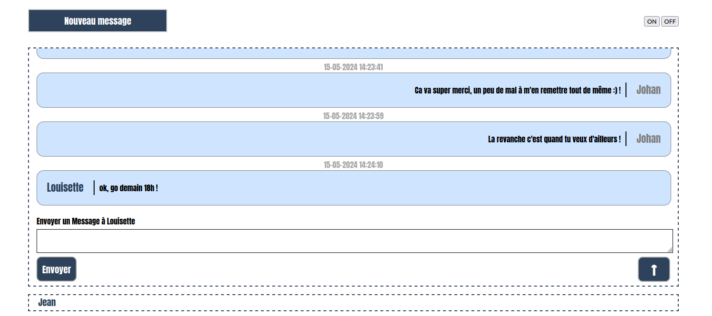

# Messagerie

## Principe / Fonctionnalité
- Permet au membres de communiquer entre eux, organiser des rencontres etc.
- Messagerie en fonctionnement simple 1 message peut être envoyé à 1 membre et ce message peut etre reçu par 1 et 1 seul membre ([!WARNING] là où je m'apercois que ma structure n'est pas bonne .. à retravailler ).
- Par soucis de sécurité, les membres mineurs d'une famille, n'ont pas accès à cette fonctionnalité. (Règle en cours d'implémentation).
- Un intérrupteur ON/OFF permettra d'activer/désactiver la messagerie ( mode "ne pas déranger" )




## Technique
J'ai opté pour une messagerie hybride
1. L'envoi des données est géré par le Controlleur, qui se charge de récupérer tout les messages concernant le Membre courant.
2. Via un service les messages sont stockés et triés dans un tableau multidimensionnel (par dates et correspondant), puis envoyé à la vue.
3. une partie du traitement est réalisé avec Twig, chaques conversations chargée et caché dans un accordéon via le CSS et JS
4. le module JS va s'occuper de l'ouverture fermeture de l'accordéon pour afficher/cacher un "fil de conversation".
5. le module JS se charge aussi de la partie réponse rapide dans chaque conversations, qui va effectuer une requête POST vers le Controlleur protégé par token CSRF .
6. sur la route du message rapide dans le controlleur, les données sont traitées/vérifiées, et une update est envoyé au hub Mercure qui fait redescendre le message instanné ainsi que des données concernant l'expéditeur.
7. le message est récupéré via le module JS et traité, par la suite on viens mettre à jour le DOM de manière *temporaire en ajoutant le/les message(s) envoyé(s)/reçu(s) en fonction des points de vue( Twig se charge de construire la conversation à l'appel de la page de messagerie, le but était de donner une impression d'instantanéité ).

## Detail
### Controlleur:
1. `#[Route('/account/message', name: 'app_account_message')]`
    - Récupère les informations du membre connecté stockés dans un cookie de session, depuis PHP 8.3 obligation d'instancier le membre.
    - Récupère via `MessageRepository` les messages ou l'`ID` de l'utilisateur est trouvé
    - Les messages sont transmis au `MessageService` puis rendu à la vue trié.
2. `MessageService.php`
    - Prends un tableau de message en argument, tableau contenant des `Message` (type :Objet) et le `Member` (type :Objet), la function traite tout les messages en fonction de l'emetteur/expéditeur, créé une entrée par destinataires et y stack les messages associés. (XX étant l'ID du correspondant) 
    
    Format de sortie -> 
    ```
    [
        "XX/Alphonse" =>[
            "0" => [ "id" => X, "content" => "xxxxxx", "created_at => "xxxxx" ],
            "1" => [ "id" => X, "content" => "xxxxxx", "created_at => "xxxxx" ],
            ],
        "XX/Robert" =>[
            "0" => [ "id" => X, "content" => "xxxxxx", "created_at => "xxxxx"],
            ],
    ]
    ```


### Template `/message/messaging.html.twig`: 
1. La `<section class="conversations">` est le containeur de toute les conversations de l'utilisateur courant, son ID est renseigner via `data-member` qui récupère l'id du l'utilisateur connecté.
2. Une variable est initialisée afin d'effectuer un contrôle sur les messages ( lu /non lu ), le but étant d'avoir une petite signalétique à partir du moment où un message est non lu. `unreadMessageExist` (:bool).
3. Boucle sur la variable `conversations` incluant les index, format `ID / PrénomMembre`, un split est effectué avec pour motif de séparation `/`.
```
informationsMember[]
informationsMember[0] # ID du Membre ex : 12
informationsMember[1] # Prénom du Membre ex : Jean
```
4. Pour chaques `conversation` une balise `<a class="button recipient">` est créée contenant la valeur de l'id du correspondant dans `data-member-id`
5. On boucle à nouveau dans chaques `conversation` pour récréer le fil de discussion, un token CSRF est inclut dans la page et envoyé à chaques envoi de message instantané.

### Modules JS, `/message/manageMessages.js`
1. à l'init, pose des listeners sur chaque éléments de conversation (`<a>`)
2. au click, bloque le comportement par default, lance le script de marquage de message comme lu `markMessagesAsRead()`, méthode qui effectue une requête `GET` pour passer les messages avec le correspondant à -lu- via le endpoint `http://127.0.0.1:8000/account/message/read/${targetId}`.
3. Vérifie si il y a déja une balise span alerte présente, si oui, la retire.
4. Si la section ciblé ne contient pas la classe `expanded` alors on viens retirer la classe `expanded` de la section où elle est ( modèle accordion ) via la méthode `removeExpandedClass()`.
5. La section contenant la discussion est envoyée à la méthode de calcul de hauteur pour un affichage fluide, on récupère tout les éléments qui composent la section `targetSection.children`( empilement de div, formant un fil de conversation ),qui est envoyé dans la méthode du module `calculHeightElement()` on boucle sur la taille de chaques éléments qu'on additionne au resultat précédent pour avoir la hauteur total de l'élément à faire apparaitre, valeur qui est ensuite retournée.
6. La valeur reçu permet de modifier la hauteur de l'élément `targetSection.style.height`, et ensuite y appliquer un effet smooth appears via le css `messaging.css`, les règles `overflow: hidden; transition:1s height;` sur l'élément `section.conversations>section`.
7. on ajuste l'affichage pour garder le focus sur le nouvel élément de discussion `targetSection.scrollTop = targetSection.scrollHeight;`.
8. Sinon , cas où nous souhaitons juste fermer une discussion sans en ré ouvrir une, on retire la classe `expanded` et on réattribute une hauteur de 2 em à l'élément.

### Modules JS : `/message/sendMessage.js`
1. A l'init on bind tout les bouttons "envoyer", et on y pose les events au "click".
2. on récupére l'url contenu dans le bouton d'envoi et le contenu du message puis on fetch les données `fetchDataToSend(fetchUrl, contenu)`.
3. Via le endpoint fournit en argument, on récupère l'ID du destinataire,pour pouvoir l'insérer ensuite dans le corps de la requetes.
4. Pas d'assainissement des données, le back se charge de vérifier l'intégrité de l'entité avant le flush..
5. Contrôle CSRF, le token est recupéré sur le DOM, envoyé dans le header et comparé par le contrôller. 
```
const response = await fetch(linkToFetch, 
    {
        method: "POST",
        headers: {
            'Content-Type': 'application/json',
            'X-CSRF-TOKEN': document.getElementById('send-message').value,
        },
        body: JSON.stringify({
            recipient: parseInt(recipientId),
            content : messageContent
        })
    }
);
```

### Modules JS : `mercure.js`
Une balise `<script>` est placé sur la page de messagerie afin de "souscrire" aux evennements mercure. Comme la documentation officelle le recommande on utilise `eventSource.onmessage(evt)` pour observer si un évennement est déclenché, le `Controller` profite de l'event pour envoyer les informations nécéssaire à la construction temporaire du message.
1. A chaque fois qu'un message est envoyé via la route `/account/message/send/{recipient}` en POST, une update est créer, cette update fait transiter en json : 
```
        $update = new Update(
            ['send-message'],
            json_encode(['message' => 
                [
                    "date"=>$message->getCreatedAt(),
                    "sender"=>[
                        $message->getSender()->getId(),
                        $message->getSender()->getFirstName(),
                    ],
                    "recipient" => [
                        $message->getRecipient()->getId(),
                        $message->getRecipient()->getFirstName(),
                    ],
                    "content" => $message->getContent(),
                ]
            ])
        );
```
ces données font partie de "l'évenement".

2. A chaques évennement donc, on déstructure les données contenues dans `eventData.message`.
3. on verifie via l'ID du membre courant inclut dans le data-set `<section class="conversations" data-member="1">` qu'il est impliqué dans la discussion, afin d'éviter toute confusions.
4. Nettoyage des dates !TODO -> amélioration possible avec les locales.
5. Partie un peu casse tête, on à potentiellement 2 points de vue possible le but est de cibler la bonne discussion pour venir y placer la réponse instantannée.
```
const conversationTargetElement = (document.querySelector(`a.button.recipient[data-member-id='${recipientId}']`) != null) 
    ? document.querySelector(`a.button.recipient[data-member-id='${recipientId}']`)
    : document.querySelector(`a.button.recipient[data-member-id='${senderId}']`)
```
- Côté client `sender` : on viens vérifier que dans le DOM que `recipientId` récupéré dans l'`event` existe dans un des data-set, si c'est bien le cas, c'est que nous nous trouvons sur le client expéditeur, il faut selectionné la conversation ou le data-set correpond à notre correspondant (`recipientID`).
- Côté client `recipient` : ici, le else de la ternaire entre en jeu puisque le `recipientId` n'a pas été trouvé, donc je cible la conversation qui à le `senderId` dans son data-set, nous somme sur l'affichage du destinataire.

6. Le reste du module implante dans la conversation selectionné les nouvelles réponses, rien de trop barbu là dedans.