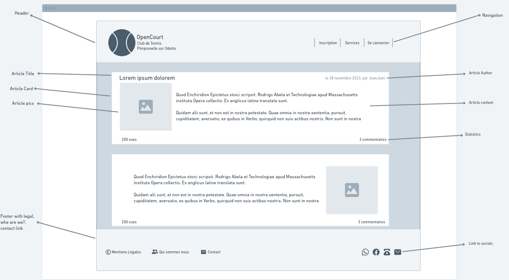
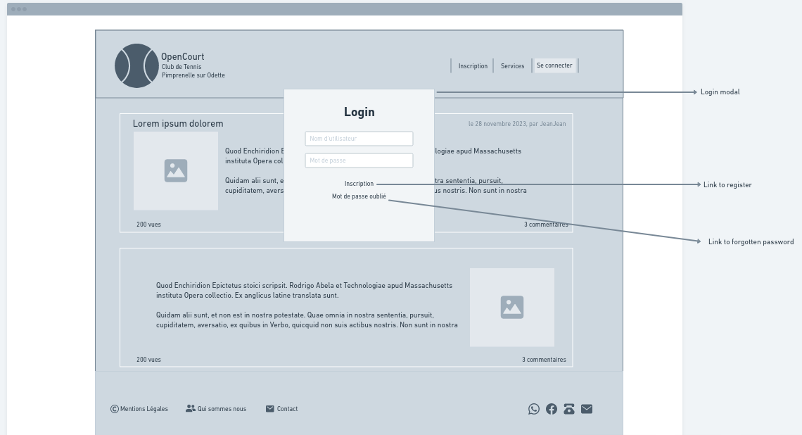
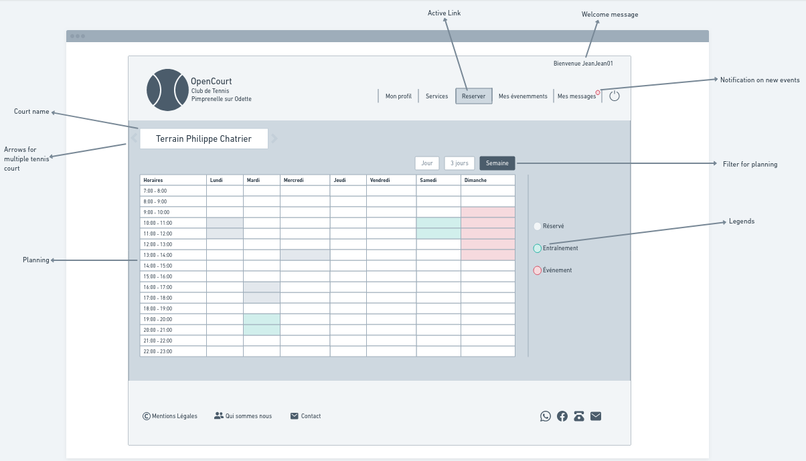
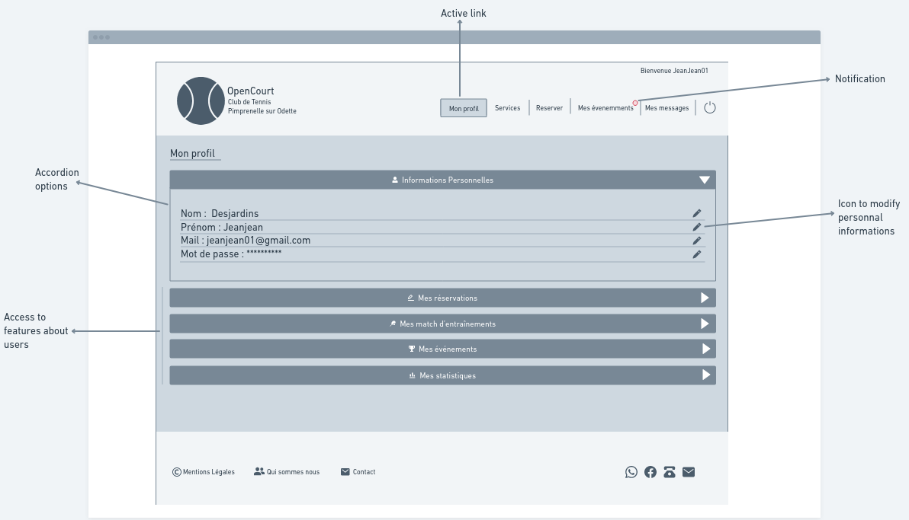
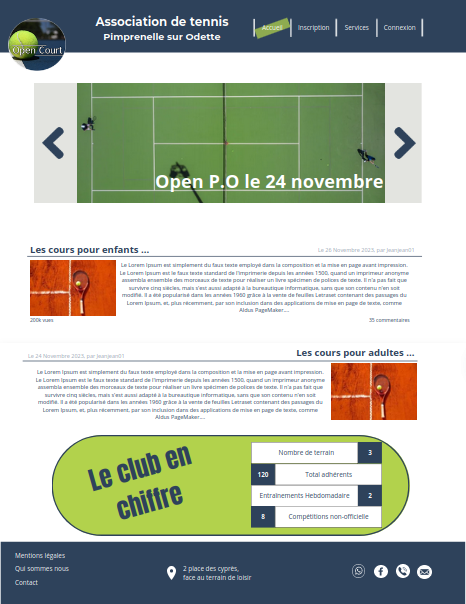

#   OpenCourt: 

OpenCourt est une application conçu et pensée pour répondre au besoin de digitalisation de petites structure de tennis loisir et à pour but de répondre aux problématique rencontrés par les association qui gèrent de petit clubs de tennis, cela permettrait par exemple:
  - De simplifier l'accès au court, actuellement le seul moyen de reserver est de se déplacer jusqu'au terrain pour s'y inscrire.
  - éviter les corvées manuelles comme le remplacement ses plannings de reservation chaques semaine.
  - L'association a peu de visibilité ( village de 1500 habitants / 40 adhérents ) dans et hors du village.
  - Animer le club et faire participer les adhérents.
  - Favoriser les rencontres entre adhérents.
  - Diffuser des informations relative à l'association.

</br>

# MVP
- L'affichage des services proposés par l'association ( cours , réunions , ect .. )
- L'inscription en ligne d'un adhèrent.
- La réservation en ligne du court pour l'adhérent certifié.
- Une messagerie interne.
- Une interface pour gérer les adhérents.
- De quoi ajouter du contenu vitrine et des informations sur l'association.
- Créer et gérer un évènement de type tournois/championnat. 

  ## Potentielle évolution :
  - un système de classement pour les joueurs
  - un matchmaking qui proposerait des choix pertinents pour le niveau de l'adhérent. 

# Les Technos
- Symfony webapp
- Twig

  ## Dans un second temps
  Dans un second temps peut être une API, couplée à du React native pour de l'App mobile 

# User Stories
| En tant que | Je souhaite | Afin | Commentaires |
|--|--|--|--|
| Visiteur | Voir et m'informer des services/évènements proposés par l'association | Pouvoir envisager de m'inscrire |  |
| Visiteur | Pouvoir m'inscrire en ligne | Profiter du terrain et des services/évènements |  |
| Adhérent | Pouvoir réserver le terrain en ligne | Ne pas me déplacer jusqu'au terrain |  |
| Adhérent | Pouvoir voir le planning en temps réel | Ne pas réserver un créneau déjà occupé |  |
| Adhérent | Pouvoir communiquer avec l'association ou les autres adhérents | Avoir des réponses à mes questions / Rencontrer d'autres joueurs |  |
| Adhérent | Pouvoir participer aux événements proposés par l'association | Participer/Échanger |  |
| Adhérent | Pouvoir proposer un match à un autre adhérent | M'amuser et progresser | V2 |
| Adhérent | Souhaiter que l'on me propose des potentiels adversaires de mon niveau | Ne pas m'embêter à chercher | V2 |
| Administrateur | Pouvoir accéder à la liste des inscrits | Voir le nombre de personnes potentiellement intéressées |  |
| Administrateur | Certifier un adhérent qui a réglé sa cotisation | Qu'il puisse accéder à toutes les fonctionnalités |  |
| Administrateur | Pouvoir créer du contenu pour la page d'accueil | Rendre attractif le club de tennis |  |
| Administrateur | Pouvoir réserver des créneaux hebdomadaires de manière automatique pour les cours dispensés | Ne plus avoir à le faire chaque semaine |  |
| Administrateur | Pouvoir créer/gérer des évènements de type tournois/championnat | Dynamiser le club |  |
| Administrateur | Diffuser par mail 

</br></br>

# Routes
</br></br>
  
  ## Hiérarchie des roles
    ANONYME > USER > MANAGER > ADMIN 

| route | option | methode | commentaires | autorisations |
|--|--|--|--|--|
| /home | - | GET | - | ANONYME |
| /actu | - | GET | - | ANONYME |
| /actu/titre-actu | slug | GET | - | ANONYME |
| /inscription | - | POST | - | ANONYME |
| /connexion | - | POST | - | ANONYME |
| /profil | - | GET | affichage de son profil | USER |
| /profil/update | - | GET/POST | modificatiuon de son profil | USER |
| /reservation | - | GET/POST | le GET affichera les disponibilité planning, le POST la reservation | USER |
| /events | - | GET | affiche tout les tournois en cours | USER |
| /events/numéro | id | GET/POST | le GET affiche le tournois, le POST permettra l'inscription | USER |
| /messages | - | GET/POST | GET reception des messages, POST envoi de messages | USER |
| /back | - | GET | statistique synthétique de l'association | MANAGER |
| /back/users | - | GET | liste les utilisateurs | MANAGER |
| /back/users/numéro | id | GET/POST | en GET affiche un utilisateur via son ID, en POST modifie l'utilisateur | MANAGER |
| /back/users/numéro/delete | id | DELETE | supprime un utilisateur | MANAGER |
| /back/actus | - | GET | liste les actualités | MANAGER |
| /back/actus/titre-actu | slug | GET | liste les actualités | MANAGER |
| /back/actus/titre-actu/delete | slug | DELETE | supprime une actualité | MANAGER |
| /back/actus/new | - | POST | créer une actualité | MANAGER |
| /back/event | - | GET | liste les events en cours | MANAGER |
| /back/event/numéro | id | GET/POST | affiche un événement, modifie un événement | MANAGER |
| /back/events/new | - | POST | créer un nouvel événement | MANAGER |
| /back/events/numéro/delete | id | DELETE | supprime un évènement | MANAGER |

</br></br></br>

# MCD (raw)

```
BELONG, 11 EVENT, 11 EVENTPARTICIPANT
EVENTPARTICIPANT: event_num, player_num
ENROLLED, 0N USER, 11 EVENTPARTICIPANT
WRITE, 11 ACTU, 0N USER
ACTU: actu_num, title, image, content, published_at, author, created_at, updated_at
:

EVENT: event_num, title, is_open, players, start_at, winner, second, third
MESSAGE: message_num, recipient, sender, title, content
SEND, 1N MESSAGE, 0N USER
USER: email, password, match_count, level
PARTICIPATE, 0N COURSE, 0N USER
COURSE: course_num, capacity, start_course, end_course

CONSTITUED, 01 MATCH, 1N EVENT
MATCH:match_num, player_1, player_2, player_1_set1, player_1_set2, player_2_set1, player_2_set2, player_1_tb, player_2_tb, winner, played_at
PLAYED, 1N MATCH, 0N USER
ENGAGE, 0N USER, 11 SLOTS
SLOTS: slot_num, start_at, end_at
OCCUP, 11 SLOTS, 1N COURSE

:
:
:
:
RELATED, 1N COURT, 11 SLOTS
COURT: court_num, is_active, surface, is_lighted
```

# MCD


</br></br>

# Dico de données
</br></br>

# Arborescence


</br></br>

# Wireframe

- Wireframe Mobile 

  
</br></br>

- Wireframe Desktop
  - Landing page
    
  - Login modal
    
  - Book your court !
    
  - Your Profil !
    
</br></br>

# Maquette
  