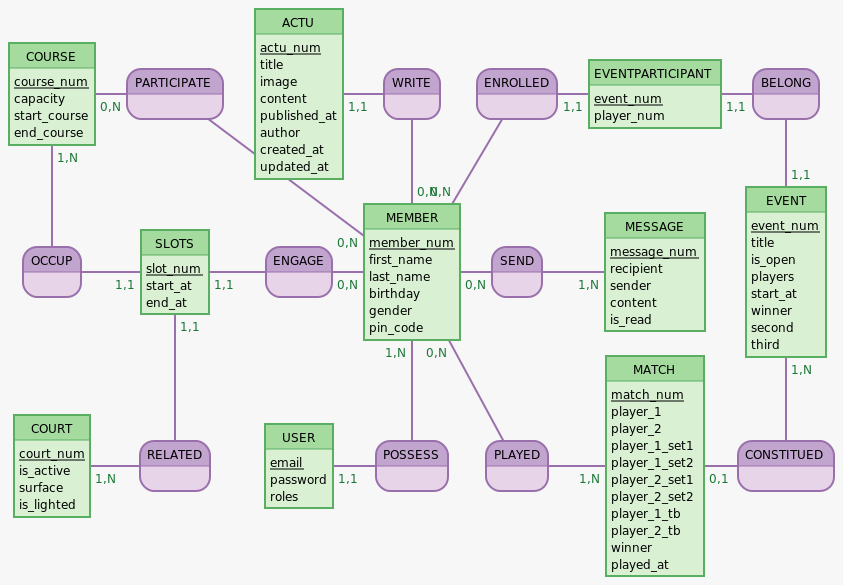

#   OpenCourt: 

OpenCourt est une application conçu et pensée pour répondre au besoin de digitalisation de petites structure de tennis loisir et à pour but de répondre aux problématique rencontrés par les association qui gèrent de petit clubs de tennis, cela permettrait par exemple:
  - De simplifier l'accès au court, actuellement le seul moyen de reserver est de se déplacer jusqu'au court pour s'y inscrire.
  - éviter les corvé manuelle comme le remplacement ses planning de reservation chaques semaines.
  - L'association n'a que trop peu de visibilité ( village de 1500 habitants / 40 adhérents ) dans et hors du village.
  - Animer le club et faire participer les adhérents.
  - Favoriser les rencontres entres adhérents.
  - Diffuser des informations relative à l'association.

</br>

# MVP
- L'affichage des services proposés par l'association ( cours , réunions , ect .. )
- L'inscription en ligne d'un adhèrent.
- La réservation en ligne du court pour l'adhérent certifié
- Une messagerie interne.
- Une interface pour gérer les adhérents
- De quoi ajouter du contenu vitrine et des informations sur l'association.
- créer et gérer un évènement de type tournois/championnat. 

  ## Potentielle évolution :
  - un système de classement pour les joueurs
  - un matchmaking qui proposerait des choix pertinent pour le niveau de l'adhérent. 

# Les Technos
- Symfony webapp
- Twig

  ## Dans un second temps
  Dans un second temps peut être une API , couplé à du React native pour de l'App mobile 

# User Stories
| En tant que | je souhaite | afin | commentaires |
|--|--|--|--|
| visiteur | je souhaite voir et m'informer des services/évènements proposé par l'association | pouvoir envisager de m'inscrire |
| visiteur | je souhaite pouvoir m'inscrire en ligne | profiter du terrain et des services/évènements |
| adhérent | je souhaite pouvoir réserver le terrain en ligne | ne pas me déplacer jusqu'au terrain |
| adhérent | je souhaite pouvoir voir le planning en temps réel | ne pas réservé un créneau déjà occupé |
| adhérent | je souhaite pouvoir communiquer avec l'association ou les autres adhèrents | afin d'avoir réponse à mes questions / rencontrer d'autres joueurs |
| adhérent | je souhaite pouvoir participer aux événements proposés par l'association | participer/échanger |
| adhérent | je souhaite pouvoir proposer un match a un autre adhèrent |de m'amuser et progresser | v2 |
| adhérent | je souhaite que l'on me propose des potentiels adversaires de mon niveau | ne pas m'embêter à chercher | v2 |
| administrateur | pouvoir accéder à la liste des inscrits | voir le nombre de personnes potentiellement intérréssé |  |
| administrateur | certifié un adhèrent qui a régler sa cotisation | qu'il puisse accéder a toutes les fonctionnalités. |  |
| administrateur | pouvoir créer du contenu pour la page d'accueil | de rendre attrayant le club de tennis |  |
| administrateur | je souhaite pouvoir réserver des créneaux hebdomadaire de manière automatique pour les cours dispensés | ne plus avoir à le faire chaques semaines |  |
| administrateur | pouvoir créer/gerer des évènements de type tournois/championnat | de dynamiser le club |  |
| administrateur | diffuser par mail des nouvelles/informations aux adhérents de l'association | de communiquer les informations importante / fidéliser les adhérents |  |
|--|--|--|--|

</br></br>

# Routes
</br></br>
  
  ## Hiérarchie des roles
    ANONYME > USER > MANAGER > ADMIN 

| route | option | methode | commentaires | autorisations |
|--|--|--|--|--|
| /home | - | GET | - | ANONYME |
| /actu | - | GET | - | ANONYME |
| /actu/titre-actu | slug | GET | - | ANONYME |
| /inscription | - | POST | - | ANONYME |
| /connexion | - | POST | - | ANONYME |
| /profil | - | GET | affichage de son profil | USER |
| /profil/update | - | GET/POST | modificatiuon de son profil | USER |
| /reservation | - | GET/POST | le GET affichera les disponibilité planning, le POST la reservation | USER |
| /events | - | GET | affiche tout les tournois en cours | USER |
| /events/numéro | id | GET/POST | le GET affiche le tournois, le POST permettra l'inscription | USER |
| /messages | - | GET/POST | GET reception des messages, POST envoi de messages | USER |
| /back | - | GET | statistique synthétique de l'association | MANAGER |
| /back/users | - | GET | liste les utilisateurs | MANAGER |
| /back/users/numéro | id | GET/POST | en GET affiche un utilisateur via son ID, en POST modifie l'utilisateur | MANAGER |
| /back/users/numéro/delete | id | DELETE | supprime un utilisateur | MANAGER |
| /back/actus | - | GET | liste les actualités | MANAGER |
| /back/actus/titre-actu | slug | GET | liste les actualités | MANAGER |
| /back/actus/titre-actu/delete | slug | DELETE | supprime une actualité | MANAGER |
| /back/actus/new | - | POST | créer une actualité | MANAGER |
| /back/event | - | GET | liste les events en cours | MANAGER |
| /back/event/numéro | id | GET/POST | affiche un événement, modifie un événement | MANAGER |
| /back/events/new | - | POST | créer un nouvel événement | MANAGER |
| /back/events/numéro/delete | id | DELETE | supprime un évènement | MANAGER |

</br></br></br>

# MCD (raw)

```
EVENT: event_num, title, is_open, players, start_at, winner, second, third
BELONG, 11 EVENT, 11 EVENTPARTICIPANT
EVENTPARTICIPANT: event_num, player_num
:
:

CONSTITUED, 01 MATCH, 1N EVENT
:
ENROLLED, 0N USER, 11 EVENTPARTICIPANT
WRITE, 11 ACTU, 0N USER
ACTU: actu_num, title, image, content, published_at, author, created_at, updated_at

MATCH:match_num, player_1, player_2, player_1_set1, player_1_set2, player_2_set1, player_2_set2, player_1_tb, player_2_tb, winner, played_at
PLAYED, 1N MATCH, 0N USER
USER: email, password, match_count, level
PARTICIPATE, 0N COURSE, 0N USER
:

:
SEND, 1N MESSAGE, 0N USER
RESERVE, 0N COURT, 01 USER
COURSE: course_num, capacity, start_course, end_course
:

:
MESSAGE: message_num, recipient, sender, title, content
COURT: court_num, reserved_time, start_reservation, end_reservation, is_active
GIVEN, 01 COURT, 1N COURSE
:
```

# MCD


</br></br>

# Dico de données
</br></br>

# Arborescence


</br></br>

# Wireframe

- Wireframe Mobile 


</br></br>

- Wireframe Desktop

</br></br>

# Maquette